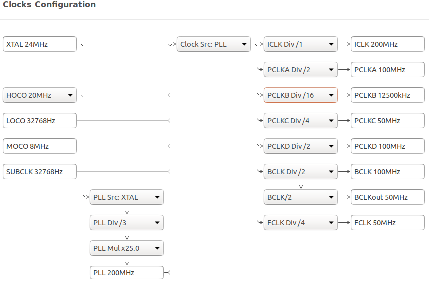
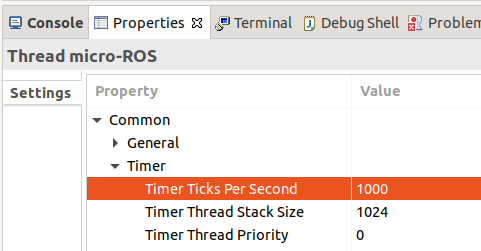
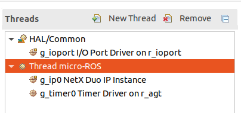
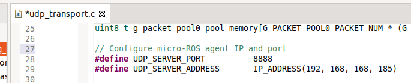
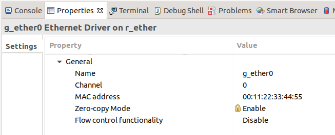

# micro-ROS for Renesas e<sup>2</sup> studio

This tool aims to ease the micro-ROS integration in a Renesas e<sup>2</sup> studio project.

## Requeriments

1. Renesas e<sup>2</sup> studio for Linux
2. Install board pack on e<sup>2</sup> studio: [Guide](Install_packs.md).
3. Docker
## How to use it

micro-ROS can be used with Renesas e<sup>2</sup> studio following these steps:

1. Clone this repository in your Renesas e<sup>2</sup> studio project folder
2. Go to `Project -> Properties -> C/C++ Build -> Settings -> Build Steps Tab` and in `Pre-build steps` add:

```bash
docker pull microros/micro_ros_static_library_builder:foxy && docker run --rm -v ${TCINSTALL}:/toolchain -v ${workspace_loc:/${ProjName}}:/project --env MICROROS_LIBRARY_FOLDER=micro_ros_renesas2estudio_component microros/micro_ros_static_library_builder:foxy "${cross_toolchain_flags}"
```

3. Add micro-ROS include directory. In `Project -> Settings -> C/C++ Build -> Settings -> Tool Settings Tab -> GNU ARM Cross C Compiler -> Includes` add `"${workspace_loc:/${ProjName}/micro_ros_renesas2estudio_component/libmicroros/include}"` in `Include paths (-l)`
4. Add the micro-ROS precompiled library. In `Project -> Settings -> C/C++ Build -> Settings -> Tool Settings Tab -> GNU ARM Cross C Linker -> Libraries`
      - add `"${workspace_loc:/${ProjName}/micro_ros_renesas2estudio_component/libmicroros}"` in `Library search path (-L)`
      - add `microros` in `Libraries (-l)`
5. Add the following source code files to your project, dragging them to source folder:
      - `extra_sources/microros_time.c`
      - `extra_sources/microros_allocators.c`
      - `extra_sources/microros_allocators.h`
      - `extra_sources/microros_transports.h`

6. Configure `g_timer0` as an `r_agt`.
   1. Double click on the `configuration.xml` file of your project and go to the `Components` tab.
   2. Filter for `timer` and enable the `r_agt` timer:

      

   3. Go to the `Stacks` tab, then select `New Stack -> Driver -> Timers -> Timer Driver on r_agt`.
   4. Modify the clock period on the component properties (`Module g_timer0 Timer Driver on r_agt -> General -> Period`) to `0x800000`
   5. Modify the count source on the component properties (`Module g_timer0 Timer Driver on r_agt -> General -> Count Source`) to `PCLKB`
   6. Modify the interrupt callback on the component properties (`Module g_timer0 Timer Driver on r_agt -> Interrupt -> Callback`) to `micro_ros_timer_cb`
   7. Modify the underflow interrupt priority on the component properties (`Module g_timer0 Timer Driver on r_agt -> Interrupt -> Underflow Interrupt Priority`) to `Priority 15`

      

   8. Make sure that PCLKB is set to 12500 kHz in `Clocks` tab:

      

   9.  Save the modification using `ctrl + s` and click on `Generate Project Content`.

7. Configure the transport: [Detail](##Micro-XRCE-DDS-transport-configuration)
8. Configure the Main stack and Heap size:
   1. On the `configuration.xml` menu, go to the `BSP` tab.
   2. Go to the `RA Common` section and set the `Main stack size (bytes)` and `Heap size (bytes)` fields to 5000:

      

      Note: If using an RTOS, the stack size should be configured individually for each thread.

   3. Save the modification using `ctrl + s` and click on `Generate Project Content`.

9.  Build and run your project

## ThreadX RTOS

Instructions for using micro-ROS on Renesas e<sup>2</sup> studio ThreadX projects.

1. Create a thread to run micro-ROS:
   1. Double click on the `configuration.xml` file of your project, go to the `Stacks` tab and click on `New Thread`.
   2. On the new thread properties, set the Symbol name `Thread -> Symbol` to `thread_microros` and the thread stack to 5000.

      

   3. Change ThreadX timer from 100 to 1000 ticks per second inside the thread properties `Common -> Timer -> Timer Ticks Per Second`

      

   4. Save the modification using `ctrl + s` and click on `Generate Project Content`.
   5. Check that the file `thread_microros_entry.c` has been created on the project source directory.

2. Follow the timer (`g_timer0`) and transport configurations of the [previous chapter](##Micro-XRCE-DDS-transport-configuration), adding the components on the created thread:
   
   

3. Include your micro-ROS code inside the thread main function `thread_microros_entry` of the created file `thread_microros_entry.c`, [example](demo_project_threadx/src/thread_microros_entry.c). 
4. Build and run your project.

## Micro XRCE-DDS transport configuration
### USB transport
1. Copy the following files file to the source directory:
      - `extra_sources/microros_transports/usb_transport.c`
      - `extra_sources/microros_transports/usb_descriptor.c`
2. Double click on the `configuration.xml` file of your project and go to the `Components` tab.
3. Filter for `usb` and enable the `r_usb_basic` and `r_usb_pcdc` components:

   

4. Go to the `Stacks` tab, then select `New Stack -> Middleware -> USB -> USB PCDC driver on r_usb_pcdc`.
5. Go to `Clocks` tab and configure `UCLK` clock to match 48MHz (Match the values on the highlighted boxes):

   

6. Save the modification using `ctrl + s` and click on `Generate Project Content`.

### Serial transport
1. Copy the following files file to the source directory:
      - `extra_sources/microros_transports/uart_transport.c`
2. Double click on the `configuration.xml` file of your project and go to the `Components` tab.
3. Filter for `uart` and enable the `r_sci_uart` component.
4. Go to the `Stacks` tab, then select `New Stack -> Driver -> Connectivity -> r_src_uart`.
5. Go to the component properties and configure the Tx/Rx pinout:

   

6. Save the modification using `ctrl + s` and click on `Generate Project Content`.

### UDP transport (ThreadX)
1. Copy the following files file to the source directory:
      - `extra_sources/microros_transports/udp_transport.c`

2. Configure the micro-ROS Agent IP and port on the `udp_transport.c` file:

   

3. Double click on the `configuration.xml` file of your project.
4. Go to the `Stacks` tab, then select `New Stack -> Azure RTOS -> NetX Duo -> NetX Duo IP instance`.
5. Go to the component properties and configure the board network parameters:

   

6. Select the Ethernet Driver module `g_ether0` and set the board MAC address on `Module g_ether0 Ethernet Driver on r_ether -> General -> MAC address`.

   

7.  Save the modification using `ctrl + s` and click on `Generate Project Content`.

## License

This repository is open-sourced under the Apache-2.0 license. See the [LICENSE](LICENSE) file for details.

For a list of other open-source components included in this repository,
see the file [3rd-party-licenses.txt](3rd-party-licenses.txt).

## Known Issues/Limitations

There are no known limitations.
