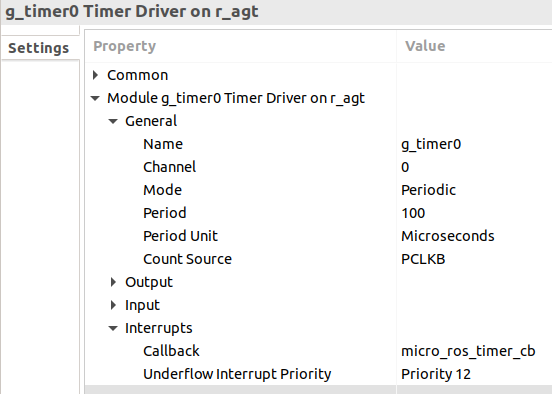
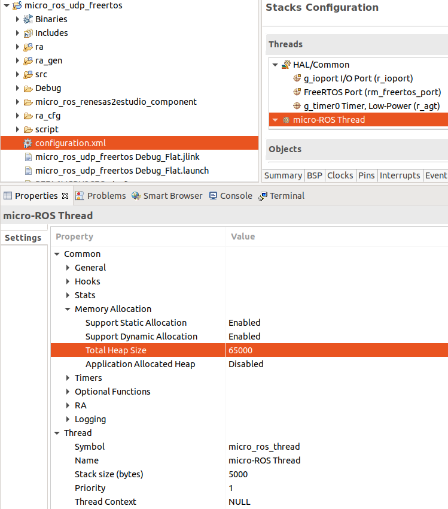
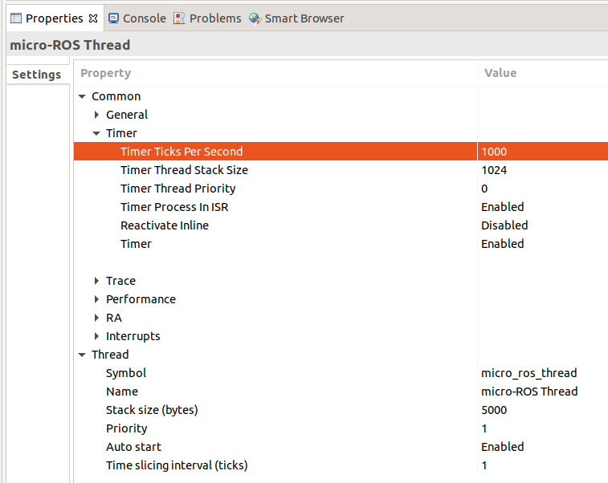

# micro-ROS for Renesas e<sup>2</sup> studio

[](https://github.com/micro-ROS/micro_ros_renesas_testbench/actions/workflows/ci.yml)
[](https://github.com/micro-ROS/micro_ros_renesas_testbench/actions/workflows/build_agent.yml)

This package eases the integration of [micro-ROS](https://micro.ros.org/) in a [Renesas e<sup>2</sup> studio](https://www.renesas.com/us/en/software-tool/e-studio). This components targets [Renesas RA family](https://www.renesas.com/us/en/products/microcontrollers-microprocessors/ra-cortex-m-mcus), an ARM Cortex-M based MCU series, enabling a full micro-ROS compatibility for developing robotics and IoT applications.

- [micro-ROS for Renesas e<sup>2</sup> studio](#micro-ros-for-renesas-esup2sup-studio)
  - [Supported platforms](#supported-platforms)
  - [Requirements](#requirements)
  - [Getting started](#getting-started)
  - [Using the micro-ROS Agent](#using-the-micro-ros-agent)
  - [Integrating micro-ROS in your project](#integrating-micro-ros-in-your-project)
  - [License](#license)
  - [Known Issues / Limitations](#known-issues--limitations)

---
## Supported platforms

| MCU | Family | Reference board | Transports |
| --- | ------ | --------------- | ---------- |
| [RA6M5](https://www.renesas.com/us/en/products/microcontrollers-microprocessors/ra-cortex-m-mcus/ra6m5-200mhz-arm-cortex-m33-trustzone-highest-integration-ethernet-and-can-fd) | RA Series | [EK-RA6M5](https://www.renesas.com/us/en/products/microcontrollers-microprocessors/ra-cortex-m-mcus/ek-ra6m5-evaluation-kit-ra6m5-mcu-group) | USB-CDC <br /> Serial UART <br /> UDP (FreeRTOS + TCP) <br /> UDP (ThreadX + NetX) <br /> TCP (AWS Secure Sockets) <br /> CAN FD |
| [RA6T2](https://www.renesas.com/us/en/products/microcontrollers-microprocessors/ra-cortex-m-mcus/ra6t2-240mhz-arm-cortex-m33-trustzone-high-real-time-engine-motor-control)     | RA Series | [MCK-RA6T2](https://www.renesas.com/us/en/products/microcontrollers-microprocessors/ra-cortex-m-mcus/rtk0ema270s00020bj-mck-ra6t2-renesas-flexible-motor-control-kit-ra6t2-mcu-group) | Serial UART <br /> CAN FD |


## Requirements

- [Renesas e<sup>2</sup> studio](https://www.renesas.com/us/en/software-tool/e-studio) for Linux<sup>1</sup>
- FSP v3.5.0 board packs for Renesas e<sup>2</sup> studio: [Details](fps_install_packs.md).
- GNU Arm Embedded Toolchain v10.3.1.20210824 (Other compatible toolchain may work).
- Install `rsync`: `apt -y install rsync`
- [Install colcon](https://colcon.readthedocs.io/en/released/user/installation.html) and dependencies, for example with:

```bash
pip3 install colcon-common-extensions catkin_pkg lark-parser empy
```

*<sup>1</sup> Currently only support for Linux is available*
## Getting started

A ready-to-use example of this component can be found in [micro-ROS demos for Renesas e<sup>2</sup> studio repo](https://github.com/micro-ROS/micro_ros_renesas_demos).
## Using the micro-ROS Agent
It is possible to use a **micro-ROS Agent** just by using this docker command:

```bash
# UDPv4 micro-ROS Agent
docker run -it --rm -v /dev:/dev -v /dev/shm:/dev/shm --privileged --net=host microros/micro-ros-agent:$ROS_DISTRO udp4 --port 8888 -v6

# TCPv4 micro-ROS Agent
docker run -it --rm -v /dev:/dev -v /dev/shm:/dev/shm --privileged --net=host microros/micro-ros-agent:$ROS_DISTRO tcp4 --port 8888 -v6

# Serial micro-ROS Agent
docker run -it --rm -v /dev:/dev -v /dev/shm:/dev/shm --privileged --net=host microros/micro-ros-agent:$ROS_DISTRO serial --dev [YOUR BOARD PORT] -v6

# CAN-FD micro-ROS Agent
docker run -it --rm -v /dev:/dev -v /dev/shm:/dev/shm --privileged --net=host microros/micro-ros-agent:$ROS_DISTRO canfd --dev [YOUR CAN INTERFACE] -v6
```

There are some other options for using the micro-ROS Agent:
 - Building it in a ROS 2 environment: [Details](https://micro.ros.org/docs/tutorials/core/first_application_linux/).
 - Using a [snap package](https://snapcraft.io/micro-ros-agent).

## Integrating micro-ROS in your project

micro-ROS can be integrated with a Renesas e<sup>2</sup> studio project following these steps:

1. Clone this repository in your **Renesas e<sup>2</sup> studio project** folder.

2. Go to `Project -> Properties -> C/C++ Build -> Settings -> Build Steps Tab` and in `Pre-build steps` add:

```bash
cd ../micro_ros_renesas2estudio_component/library_generation && ./library_generation.sh "${cross_toolchain_flags}"
```

3. Add <b>micro-ROS include directory</b>.
   <details>
   <summary>Steps</summary>

      In `Project -> Settings -> C/C++ Build -> Settings -> Tool Settings Tab -> GNU ARM Cross C Compiler -> Includes`

      - add `"${workspace_loc:/${ProjName}/micro_ros_renesas2estudio_component/libmicroros/include}"` in `Include paths (-l)`

   </details>

4. Add the **micro-ROS precompiled library**.
   <details>
   <summary>Steps</summary>

     In `Project -> Settings -> C/C++ Build -> Settings -> Tool Settings Tab -> GNU ARM Cross C Linker -> Libraries`
      - add `"${workspace_loc:/${ProjName}/micro_ros_renesas2estudio_component/libmicroros}"` in `Library search path (-L)`
      - add `microros` in `Libraries (-l)`
   </details>

6. **Add the following source** code files to your project, dragging them to source folder.
      - `extra_sources/microros_time.c`
      - `extra_sources/microros_allocators.c`
      - `extra_sources/microros_allocators.h`
      - `extra_sources/microros_transports.h`

7. Configure **micro-ROS time reference**.

   <details>
   <summary>Steps</summary>

   Configure `g_timer0` as an `r_agt`
      1. Double click on the `configuration.xml` file of your project and go to the `Stacks` tab.
      2. Select `New Stack -> Driver -> Timers -> Timer, Low-Power (r_agt)`.
      3. Modify the clock period on the component properties (`Module g_timer0 Timer, Low-Power (r_agt) -> General -> Period`) to `100`
      3. Modify the clock period unit on the component properties (`Module g_timer0 Timer, Low-Power (r_agt) -> General -> Period Unit`) to `Microseconds`
      4. Modify the count source on the component properties (`Module g_timer0 Timer, Low-Power (r_agt) -> General -> Count Source`) to `PCLKB`
      5. Modify the interrupt callback on the component properties (`Module g_timer0 Timer, Low-Power (r_agt) -> Interrupt -> Callback`) to `micro_ros_timer_cb`
      6. Modify the underflow interrupt priority on the component properties (`Module g_timer0 Timer, Low-Power (r_agt) -> Interrupt -> Underflow Interrupt Priority`) to `Priority 12`

         

      7.  Save the modifications by clicking on `Generate Project Content`.

   </details>

8. Configure **micro-ROS memory requirements**.

   <details>
   <summary>Bare Metal</summary>

   Configure the stack and heap size:

   1. On the `configuration.xml` menu, go to the `BSP` tab.
   2. Go to the `RA Common` section and set the `Main stack size (bytes)` and `Heap size (bytes)` fields to 5000 B:

      

   3. Save the modifications by clicking on `Generate Project Content`.
   </details>

   <details>
   <summary>FreeRTOS</summary>

   Create and configure the micro-ROS FreeRTOS task:

      1. On the `configuration.xml` menu, go to the `Stacks` tab and create a new thread for micro-ROS.
      2. Click on the created thread, then select `New Stack -> RTOS -> FreeRTOS Heap 4`.
      3. Configure the micro-ROS thread properties:
         1. Set the name of the thread entry function under `Thread -> Symbol` to `micro_ros_thread`.
         2. Set `Thread -> Stack size (bytes)` to 5000 B.
         3. Set `Common -> Memory Allocation -> Support Dynamic Allocation` to `Enable`.
         4. Set `Common -> Memory Allocation -> Support Static Allocation` to `Enable`.
         5. Set `Common -> Memory Allocation -> Total Heap Size` to 65000 B.

         

      4. On the `configuration.xml` menu, go to the `BSP` tab.
      5. Go to the `RA Common` section and set the `Main stack size (bytes)` and `Heap size (bytes)` fields to 5000 B:

         

         *Note: It is required to have some heap outside FreeRTOS heap because [newlib will use it](https://nadler.com/embedded/newlibAndFreeRTOS.html)*

      6.  Save the modifications clicking on `Generate Project Content`.
      7.  Check that the file `thread_microros_entry.c` has been created on the project source directory.

   </details>

   <details>
   <summary>ThreadX</summary>

   Create and configure the micro-ROS ThreadX thread:

      1. On the `configuration.xml` menu, go to the `Stacks` tab and create a new thread for micro-ROS.
      2. Configure the micro-ROS thread properties:
         1. Set the name of the thread entry function under `Thread -> Symbol` to `micro_ros_thread`.
         2. Set and the thread stack size `Thread -> Stack size (bytes)` to 5000 B.
         3. Increase thread timer resolution `Common -> Timer -> Timer Ticks Per Second` to 1000 ticks per second.

         

      3. On the `configuration.xml` menu, go to the `BSP` tab.
      4. Go to the `RA Common` section and set the `Main stack size (bytes)` and `Heap size (bytes)` fields to 5000 B:

         

      5. Save the modifications by clicking on `Generate Project Content`.
      6. Check that the file `thread_microros_entry.c` has been created on the project source directory.

   </details>

9.  Configure the **micro-ROS transports**: [Details](micro_ros_transports.md).

10. Add micro-ROS code in your codebase.

11. **Build and run** your project.
## License

This repository is open-sourced under the Apache-2.0 license. See the [LICENSE](LICENSE) file for details.

For a list of other open-source components included in this repository,
see the file [3rd-party-licenses.txt](3rd-party-licenses.txt).

## Known Issues / Limitations

There are no known limitations.
