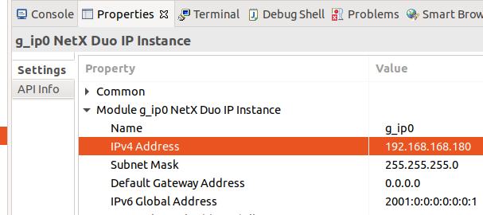

<br/>
<a>
   <p align="center">
      
      
   </p>
</a>
<br/>

# micro-ROS transports for  Renesas e<sup>2</sup> studio

Depending on which transport is used for micro-ROS specific configurations, the following should be done.

- [micro-ROS transports for  Renesas e<sup>2</sup> studio](#micro-ros-transports-for--renesas-esup2sup-studio)
  - [USB-CDC transport](#usb-cdc-transport)
  - [Serial UART transport](#serial-uart-transport)
  - [UDP transport (FreeRTOS + TCP)](#udp-transport-freertos--tcp)
  - [UDP transport (ThreadX + NetX)](#udp-transport-threadx--netx)

## USB-CDC transport
1. Copy the following files to the source directory:
      - `extra_sources/microros_transports/usb_transport.c`
      - `extra_sources/microros_transports/usb_descriptor.c`
2. Double click on the `configuration.xml` file of your project and go to the `Stacks` tab.
3. Select `New Stack -> Middleware -> USB -> USB PCDC driver on r_usb_pcdc`.
4. Go to `Clocks` tab and configure `UCLK` clock to match 48MHz (Match the values on the highlighted boxes):

   

5. Save the modifications by clicking on `Generate Project Content`.

## Serial UART transport
1. Copy the following files to the source directory:
      - `extra_sources/microros_transports/uart_transport.c`
2. Double click on the `configuration.xml` file of your project and go to the `Stacks` tab.
3. Select `New Stack -> Driver -> Connectivity -> r_src_uart`.
4. *Optional: in order to set P411 and P410 as Tx/Rx first disable SPI1*
5. Go to the component properties and configure the Tx/Rx pinout:

   

6. Save the modifications clicking on `Generate Project Content`.

## UDP transport (FreeRTOS + TCP)

1. Copy the following files to the source directory:
      - `extra_sources/microros_transports/udp_transport_freeRTOS.c`

2. Double click on the `configuration.xml` file of your project and go to the `Stacks` tab.
3. Select `New Stack -> FreeRTOS -> Libraries -> FreeRTOS + TCP`.
4. Configure the properties of the `FreeRTOS + TCP component`:
   1. `Common -> vApplicationIPNetworkEventHook` to `Disable`.
   2. `Common -> DHCP Register Hostname` to `Disable`.
   3. *Optional: Enable DHCP `Common -> Use DHCP` to `Enable`*.
   
      *Note: If DHCP is disabled, the board network parameters can be configured on the transport source file `udp_transport_freeRTOS.c` *

   4. *Optional: Increase number of buffers avaliable to the IP stack on `Common -> Total number of avaliable network buffers`*.

   

5.  Save the modifications by clicking on `Generate Project Content`.
6.  Configure micro-ROS agent IP and port passing a freeRTOS `freertos_sockaddr` struct to the `rmw_uros_set_custom_transport` function:

      ```
      struct freertos_sockaddr remote_addr;
      remote_addr.sin_family = FREERTOS_AF_INET;
      remote_addr.sin_port = FreeRTOS_htons(8888);
      remote_addr.sin_addr = FreeRTOS_inet_addr("192.168.1.185");

      rmw_uros_set_custom_transport(
         false,
         (void *) &remote_addr,
         renesas_e2_transport_open,
         renesas_e2_transport_close,
         renesas_e2_transport_write,
         renesas_e2_transport_read);
      ```

## UDP transport (ThreadX + NetX)

1. Copy the following files to the source directory:
      - `extra_sources/microros_transports/udp_transport_threadX.c`
2. Double click on the `configuration.xml` file of your project and go to the `Stacks` tab.
3. Select `New Stack -> Azure RTOS -> NetX Duo -> NetX Duo IP instance`.
4. Configure the properties of the `NetX Duo IP instance`:
   1. Configure the board network parameters:

   

   2. *Optional: Select the Ethernet Driver submodule `g_ether0` and set the board MAC address on `Module g_ether0 Ethernet Driver on r_ether -> General -> MAC address`*.

5.  Save the modifications by clicking on `Generate Project Content`.
6.  Configure micro-ROS agent IP and port passing a `custom_transport_args` struct to the `rmw_uros_set_custom_transport` function:

      ```
      custom_transport_args remote_addr = {
         .agent_ip_address=IP_ADDRESS(192,168,1,185),
         .agent_port=8888
      };

      rmw_uros_set_custom_transport(
         false,
         (void *) &remote_addr,
         renesas_e2_transport_open,
         renesas_e2_transport_close,
         renesas_e2_transport_write,
         renesas_e2_transport_read);
      ```

